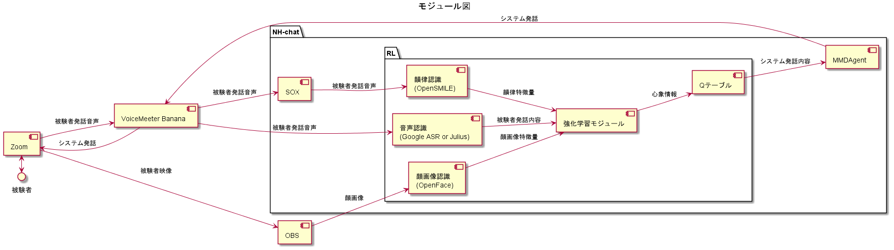
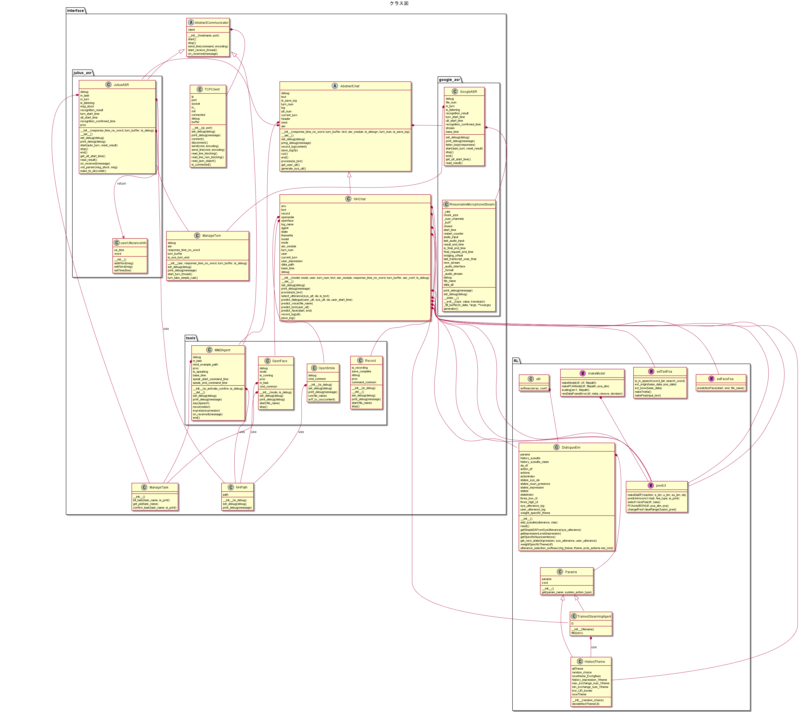
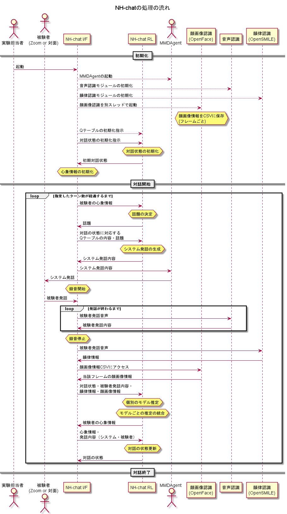
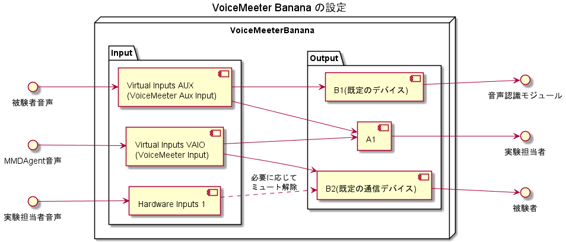

# システム構成図

PlantUMLを利用してNH-chatシステムの構成を図示した

1. uml/module.pu : モジュール図（データの流れ）
2. uml/class.pu : クラス図（リファクタリング後のもの）
3. uml/sequence.pu : NH-chatの処理の流れを表すシーケンス図
4. uml/voicemeeter.pu : VoiceMeeter Bananaの接続設定の図

# 画像

1. モジュール図（データの流れ）
    

2. クラス図（リファクタリング後のもの）
    

3. NH-chatの処理の流れを表すシーケンス図
    

4. VoiceMeeter Bananaの接続設定の図
    

